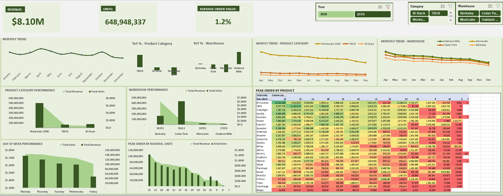

# 🛒 Consumer Product Demand — Sales & Revenue Dataset

A structured dataset containing **50,000 consumer product demand records** across multiple product categories, warehouses, and time periods. Designed for sales analytics, demand forecasting, and business intelligence reporting.



---

## 📁 File Overview

| File | Description |
|------|-------------|
| `Consumer-Product_Demand.xlsx` | Main workbook containing raw data, analysis tables, and a dashboard |

### Sheets

| Sheet | Description |
|-------|-------------|
| `DataSet` | Enriched dataset with 13 columns including derived time fields (year, month, hour) |
| `Product Demand` | Raw transactional order records (50,000 rows) |
| `Analysis` | Pre-built pivot summaries — KPIs, YoY growth, geographic and time-based analysis |
| `Dashboard` | Visual dashboard built from the analysis sheet |

---

## 📊 Dataset Schema

### `Product Demand` / `DataSet` Columns

| Column | Type | Description |
|--------|------|-------------|
| `Category` | String | Product category (Worksuite 1000, TBOX, BI Stack) |
| `Product` | String | Individual product name (e.g. VideoRight, Wordwrite) |
| `Warehouse` | String | Fulfillment warehouse (Berkeley, Cedar Park, Montcalm, Oakland Mills) |
| `ZIP Code` | Integer | Warehouse ZIP code |
| `Date` | Date | Order date |
| `Time` | Formula | Order time (VLOOKUP-derived) |
| `Units` | Integer | Units ordered per transaction |
| `Revenue` | Float | Revenue value per transaction (USD) |
| `Order Timestamp` | DateTime | Combined date + time field *(DataSet only)* |
| `Year` | Integer | Extracted year *(DataSet only)* |
| `Month Name` | String | Abbreviated month name *(DataSet only)* |
| `Month Number` | Integer | Numeric month (1–12) *(DataSet only)* |
| `Hour` | Integer | Hour of order *(DataSet only)* |

---

## 📈 Key Stats

| Metric | Value |
|--------|-------|
| Total Records | 50,000 |
| Total Revenue (CY) | ~$8.1M |
| Total Units Ordered | ~649M |
| Product Categories | 3 |
| Warehouses | 4 |
| Date Range | 2018 (raw data) |

---

## 🏭 Warehouses

| Warehouse | Revenue Share | YoY Growth |
|-----------|--------------|------------|
| Berkeley | 74.1% | +2.2% |
| Cedar Park | 13.1% | -12.3% |
| Montcalm | 7.1% | -21.1% |
| Oakland Mills | 4.5% | +34.3% |

---

## 📦 Product Categories

| Category | Revenue | YoY Growth |
|----------|---------|------------|
| Worksuite 1000 | $6.78M | -1.3% |
| TBOX | $757K | +2.1% |
| BI Stack | $562K | -0.5% |

---

## 🏆 Top 5 Products by Revenue

| Rank | Product | Revenue | Category |
|------|---------|---------|----------|
| 1 | VideoRight | $1,673,540 | Worksuite 1000 |
| 2 | Wordwrite | $1,217,575 | Worksuite 1000 |
| 3 | PublishIt | $1,158,544 | Worksuite 1000 |
| 4 | MindVis | $1,017,122 | Worksuite 1000 |
| 5 | TBOX | $951,067 | TBOX |

---

## 🚀 Potential Use Cases

- **Demand forecasting** — Identify seasonal patterns by month and day of week
- **Regional performance analysis** — Compare warehouse revenue and growth trajectories
- **Product portfolio analysis** — Evaluate which products and categories drive the most value
- **Business intelligence dashboards** — Ready-made pivot tables for Power BI or Tableau integration
- **Sales strategy** — Inform decisions on inventory allocation and promotional timing

---

## 🛠️ Requirements

To work with this file you will need:

- **Microsoft Excel** 2016 or later (recommended for full pivot table and slicer support)
- **LibreOffice Calc** 7.x (partial support — slicers not supported)
- **Python + openpyxl** for programmatic access:

```bash
pip install openpyxl
```

```python
import openpyxl
wb = openpyxl.load_workbook('Consumer-Product_Demand.xlsx', data_only=True)
ws = wb['Product Demand']
for row in ws.iter_rows(min_row=2, values_only=True):
    print(row)
```

---

## Contact Me

Thanks for taking the time to explore my work!
I’m always open to opportunities, collaborations, and conversations around data, analytics, and impactful projects.

**Email:** matildaeyubeh@gmail.com

**LinkedIn:** https://linkedin.com/in/matildaeyubeh

**GitHub:** https://github.com/NeyeTheAnalyst

**Let’s Connect If You’re:**

- Hiring a junior data analyst

- Looking for someone passionate about analytics

---

## 📄 License

This dataset is intended for analytical and educational purposes. 

---

*Generated from `Consumer-Product_Demand.xlsx` — 50,000 demand records across 4 warehouses and 3 product categories.*
